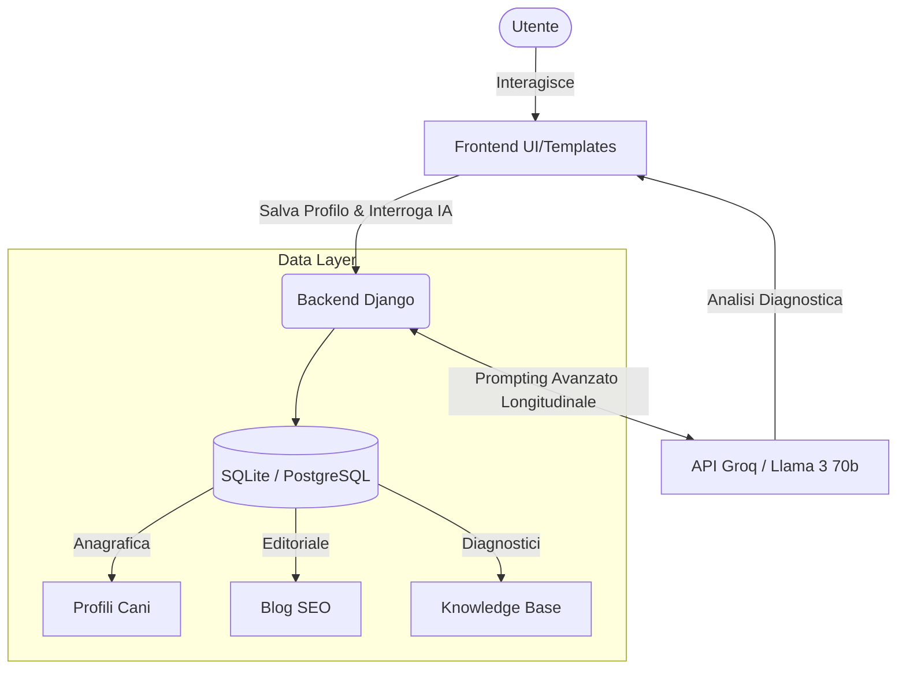

# 🐕 Vivere con il Cane - Piattaforma HealthTech AI


*🌍 [Read the English documentation](README.md)*

**Vivere con il Cane** non è un semplice blog: è una piattaforma **HealthTech** moderna basata sull'Intelligenza Artificiale. Funziona come un **Assistente Veterinario Virtuale H24**, capace di incrociare lo storico medico e comportamentale del cane per fornire raccomandazioni diagnostiche altamente personalizzate e legate al contesto.

---

## 🌟 Funzionalità Principali

### 🧠 1. Motore IA Contestuale e Memoria Longitudinale
A differenza dei chatbot generici, il nostro motore IA (alimentato da Llama-3 70b via Groq) possiede una **Memoria Longitudinale**.
- Ricorda i dati fisici del tuo cane (razza, età, peso).
- Ricorda gli eventi passati.
- Incrocia i sintomi attuali (es. "il cane zoppica") con la storia clinica pregressa (es. problemi di incontinenza legati all'età) per generare analisi o consigli estremamente precisi e profilati.

### 📚 2. Knowledge Base Relazionale (Database di Conoscenza)
Un database informativo nativo e interconnesso:
- **Razze**: Dettagli su livelli di energia, problemi comuni e consigli di cura.
- **Problemi & Soluzioni**: Una matrice complessa che collega comportamenti problematici e criticità di salute alle rispettive origini (cause) e ad azioni pratiche risolutive e misurabili.

### 📈 3. Portale Contenuti Ottimizzato SEO
Un hub educativo premium progettato per convertire e informare:
- Articoli long-form di altissima qualità redatti con cura editoriale.
- Dati strutturati semantici **Schema.org JSON-LD** per dominare i motori di ricerca.
- Interfaccia Utente (UI) Premium in stile Glassmorphism con Call-to-Action (CTA) mirate all'interazione con l'Intelligenza Artificiale.

### 📋 4. Dossier WhatsApp (Esportazione Cartella Clinica)
Genera e condividi la storia clinica completa del tuo cane via WhatsApp:
- Esporta tutti gli eventi di salute e le analisi AI in ordine cronologico.
- Condivisione con un click su WhatsApp per condividere facilmente con veterinari o familiari.
- Disponibile direttamente dalla pagina del profilo del cane.

---

## 🏗️ Architettura del Sistema



## 🛠️ Stack Tecnologico

- **Applicativo Backend**: Python 3.10+, Framework Django 5+
- **Frontend Layer**: Template Django HTML5, Variabili CSS pure, Design Responsivo (Mobile First)
- **Logica Intelligenza Artificiale**: Costruzione di prompt agentici tramite API REST Groq e modelli Open-Source allo stato dell'arte.
- **Database**: SQLite (Ambiente di Sviluppo) / PostgreSQL (Ambiente di Produzione)
- **Deployment & Scaling**: Render PaaS, WhiteNoise per l'ottimizzazione e compressione dei file statici.

---

## 🚀 Guida all'Avvio Rapido (Quick Start)

### Prerequisiti
- Python 3.8+
- Git

### Istruzioni di Installazione

1. **Clona il repository sul tuo ambiente locale**
   ```bash
   git clone https://github.com/ballales1984-wq/vivere-con-il-cane.git
   cd vivere-con-il-cane
   ```

2. **Crea e attiva un Ambiente Virtuale Sicuro**
   ```bash
   python -m venv venv
   source venv/bin/activate  # Su Windows: venv\Scripts\activate
   ```

3. **Installa tutte le Dipendenze**
   ```bash
   pip install -r requirements.txt
   ```

4. **Configurazione delle Variabili d'Ambiente**
   Crea un file `.env` nella directory principale per simulare la configurazione di produzione:
   ```env
   DEBUG=True
   SECRET_KEY=inserisci_una_chiave_segreta_sicura
   GROK_API_KEY=la_tua_chiave_api_groq_qui
   ```

5. **Migrazione Database e Inizializzazione Dati (Fixtures)**
   ```bash
   python manage.py migrate
   
   # Questo popolerà il database con contenuti IA, relazioni mediche e blog post SEO:
   python manage.py loaddata blog/fixtures/blog_data.json
   python manage.py loaddata knowledge/fixtures/knowledge_data.json
   ```

6. **Esegui il Server di Sviluppo**
   ```bash
   python manage.py runserver
   ```
   Ora puoi accedere alla piattaforma navigando a `http://127.0.0.1:8000`.

---

## 💡 Il "Segreto" del Motore IA

La vera innovazione di *Vivere con il Cane* risiede nel **Routing del Prompt**. Quando un utente fa una domanda generica (es. "Perché zoppica?"), il backend non inoltra la frase così com'è. Invece, assembla un **Super-Prompt dinamico arricchito di contesto**:
1. Estrae in background i dati biometrici del cane attivo (es. "Cane anziano di 10 anni, 25kg").
2. Recupera e processa lo storico medico pregresso del cane (es. "Nei log precedenti figurano problemi di incontinenza e dolori al bacino").
3. Impacchetta dinamicamente queste informazioni (System Prompt + User Context + User Message) e le instrada all'LLM.
*Risultato finale*: Un chatbot che non si comporta come Wikipedia, ma che simula il **flusso cognitivo reale di un medico veterinario**, individuando nessi di causalità e allarmi correlati all'età, senza che l'utente debba reinserire la propria storia ogni volta.

---

## 🤝 Contribuire
I contributi sono vitali per questo progetto, che mira a democratizzare l'informazione di altissimo livello per la salute e il benessere cinofilo. 
1. Esegui il Fork del Progetto
2. Crea un Branch per la tua modifica (`git checkout -b feature/SviluppoStrabiliante`)
3. Fai un Commit logico (`git commit -m 'Aggiunta funzionalità SviluppoStrabiliante'`)
4. Fai il Push del Branch (`git push origin feature/SviluppoStrabiliante`)
5. Apri una Pull Request documentata.

## 📄 Licenza
Il progetto è distribuito sotto Licenza Open Source MIT. Fai riferimento al file `LICENSE` per i dettagli legali completi.
