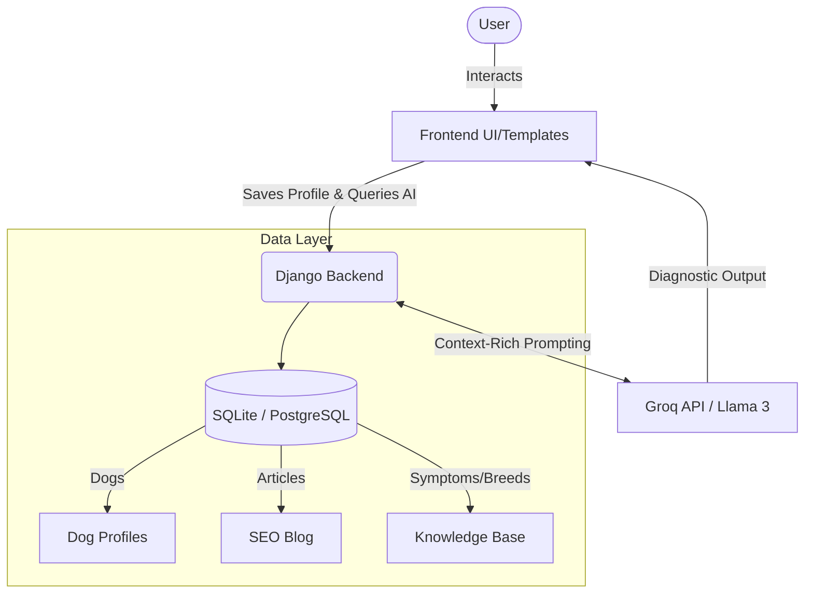

# 🐕 Vivere con il Cane (Living with your Dog) - AI HealthTech Platform


*🌍 [Leggi la documentazione in Italiano](README.it.md)*

**Vivere con il Cane** is not just a blog—it is a modern, AI-powered HealthTech platform designed for dog owners. It acts as a **24/7 Virtual Veterinary Assistant** capable of cross-referencing a dog's complete medical and behavioral history to provide highly personalized, context-aware advice. 

---

## 🌟 Key Features

### 🧠 1. Context-Aware AI Veterinary Assistant
Unlike standard chatbots, our AI engine (powered by Llama-3 70B via Groq) has **Longitudinal Memory**. 
- It remembers your dog's profile (breed, age, weight, previous conditions).
- It cross-references current symptoms (e.g., limping) with past history (e.g., incontinence, age) to provide nuanced, accurate, and safe medical/behavioral suggestions.

### 📋 2. Clinical History & Vet Sharing
- Generates a **Medical Dossier** combining past AI consultations and explicitly logged health events.
- Seamless, 1-click sharing via **WhatsApp format**, plain-text clipboard, or clean, navbar-free **PDF Print** designed specifically for veterinarians.

### 📚 3. Relational Knowledge Base
A highly structured database of canine knowledge:
- **Breeds**: Detailed insights on traits, energy levels, and common breed-specific problems.
- **Problems & Solutions**: A vast matrix of behaviors and health issues mapped directly to their root causes and actionable, step-by-step solutions.

### 📈 3. SEO-Optimized Content Hub
A premium educational portal complete with:
- Long-form, high-quality articles.
- **Schema.org JSON-LD** structured data injection for superior search engine visibility.
- Modern glassmorphism UI with gradient aesthetics and dynamic Call-to-Actions (CTAs).

### 📋 4. WhatsApp Dossier (Clinical History Export)
Generate and share your dog's complete medical history via WhatsApp:
- Exports all health events and AI analyses in chronological order.
- One-click share to WhatsApp for easy sharing with veterinarians or family.
- Available directly from the dog's profile page.

---

## 🏗️ Architecture



## 🛠️ Technology Stack

- **Backend**: Python 3.10+, Django 5+
- **Frontend**: Django Templates, Raw CSS variables, Glassmorphism UI
- **AI Integration**: Custom agentic prompt construction via Groq REST API
- **Database**: SQLite (Development) / PostgreSQL (Production)
- **Deployment**: Render, WhiteNoise for static file serving

---

## 🚀 Quick Start Guide

### Prerequisites
- Python 3.8+
- Git

### Installation

1. **Clone the repository**
   ```bash
   git clone https://github.com/ballales1984-wq/vivere-con-il-cane.git
   cd vivere-con-il-cane
   ```

2. **Set up Virtual Environment**
   ```bash
   python -m venv venv
   source venv/bin/activate  # On Windows: venv\Scripts\activate
   ```

3. **Install Dependencies**
   ```bash
   pip install -r requirements.txt
   ```

4. **Environment Variables**
   Create a `.env` file in the root directory:
   ```env
   DEBUG=True
   SECRET_KEY=your_secret_key
   GROK_API_KEY=your_groq_api_key_here
   ```

5. **Database Initialization & Fixtures**
   ```bash
   python manage.py migrate
   
   # Load high-quality sample data matrices
   python manage.py loaddata blog/fixtures/blog_data.json
   python manage.py loaddata knowledge/fixtures/knowledge_data.json
   ```

6. **Run the Application**
   ```bash
   python manage.py runserver
   ```
   Navigate to `http://127.0.0.1:8000` to interact with the platform.

---

## 💡 How the AI Reasoning Engine Works

When a user asks a question (e.g., "My dog is limping"), the backend doesn't just forward the question. It builds a **context-rich super-prompt**:
1. Fetches the active Dog Profile (e.g., "Prince, 10 years old, Mixed Breed").
2. Retrieves past analyses (e.g., "Has a history of incontinence").
3. Retrieves relevant Knowledge Base snippets (e.g., "Arthritis in older dogs").
4. Sends the packaged context to the LLM.
*Result*: The AI returns a response that accounts for age, weight, and past medical history, simulating a real veterinary diagnostic workflow.

---

## 🤝 Contributing
Contributions are highly welcome. This project aims to democratize high-quality canine health information.
1. Fork the Project
2. Create your Feature Branch (`git checkout -b feature/AmazingFeature`)
3. Commit your Changes (`git commit -m 'Add some AmazingFeature'`)
4. Push to the Branch (`git push origin feature/AmazingFeature`)
5. Open a Pull Request

## 📄 License
Distributed under the MIT License. See `LICENSE` for more information.